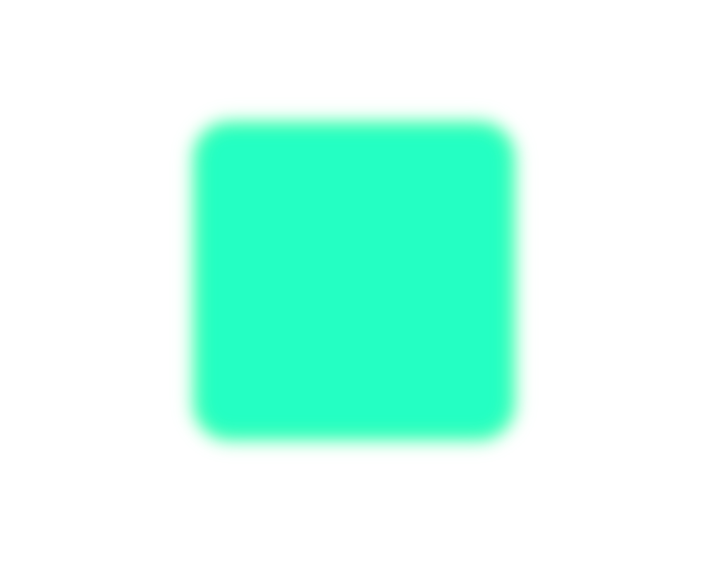

  

<!-- --------------------------------------------------------------------------------------------------------------------------------------------------------- -->

<h3 align="center">NTNU PhD student | R&D Intern</h3>

<!-- About --------------------------------------------------------------------------------------------------------------------------------------------------- -->
 

    <b> Currently working with design and simulation of Josephson junction-based superconducting circuits as a roadmap for large-scale fault-tolerant Quantum Computing in the NISQ era. </b>

<!-- Stats --------------------------------------------------------------------------------------------------------------------------------------------------- -->
 

<!-- Langs --------------------------------------------------------------------------------------------------------------------------------------------------- -->

  <code></code>
  <code>  </code>
  <code>  </code>
  <code>  </code>
  <code>  </code>
  <code>  </code>
  

